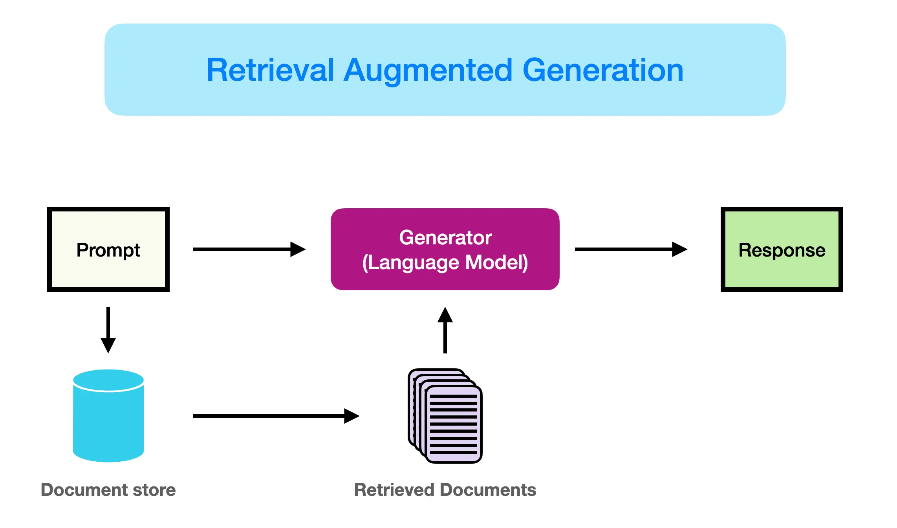
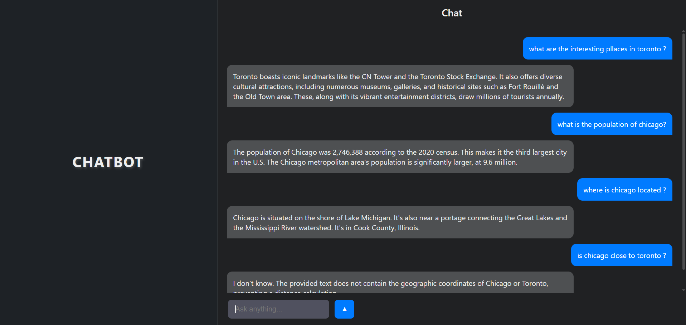

# Question-Answering Website with RAG and FAISS using EvaDB

## What is RAG (Retrieval-Augmented Generation)?
Retrieval-Augmented Generation (RAG) is an advanced natural language processing (NLP) technique that combines **retrieval-based** and **generation-based** approaches to improve the quality and accuracy of responses generated by a language model. Instead of relying solely on pre-trained knowledge, RAG dynamically retrieves relevant information from an external knowledge base (e.g., Wikipedia) and then uses a language model to generate a well-informed response.

In this project, we use **Gemini 1.5 Flash** as the LLM and FAISS (Facebook AI Similarity Search) for vector storage and retrieval.


## Project Overview
This project implements a **RAG pipeline** using Wikipedia data for city-based question-answering. The system extracts information from Wikipedia articles about cities like **Toronto, Chicago, Houston, Boston, and Atlanta**, generates structured JSON files for search, and then answers user questions by retrieving relevant data from a vector database.

The main modifications in this project compared to the original RAG implementation (linked below) include:
- Using **Gemini 1.5 Flash API** as a free model for the retrieval and generation tasks.
- Implementing a **web-based front-end** for user interaction.

Original inspiration: [pchunduri6/rag-demystified](https://github.com/pchunduri6/rag-demystified)

The only problem for me was that the user waas trying to use premium API's for his project, i wanted to implement a few changes because of that.

---

## Project Structure
### **1. Functions.py**
This file contains core functions that interact with the **LLM**, **vector embedding generation**, and **database retrieval**. 

Some key functions:
#### **Summary Retrieval**
```python
 def summary_retrieval(llm_model, question, doc):
    """Returns the answer to a summarization question over the document using summary retrieval."""
    try:
        user_prompt = f"""Here is some context: {doc}
        Use only the provided context to answer the question.
        Here is the question: {question}"""

        return free_llm_call(model=llm_model, user_prompt=user_prompt)
    except Exception:
        return "Error: Could not generate summary."
```
This function generates answers by summarizing a given document using the **LLM (Gemini 1.5 Flash)**.

#### **Response Aggregator**
```python
 def response_aggregator(llm_model, question, responses):
    """Aggregates the responses from the subquestions to generate the final response."""
    try:
        system_prompt = """You are an assistant for question-answering tasks.
        Use the following pieces of retrieved context to answer the question.
        If you don't know the answer, just say that you don't know.
        Use three sentences maximum and keep the answer concise."""

        context = "\n".join(responses)
        user_prompt = f"Question: {question}\nContext: {context}\nAnswer:"
        return free_llm_call(model=llm_model, system_prompt=system_prompt, user_prompt=user_prompt)
    except Exception:
        return "Error: Could not aggregate responses."
```
This function collects responses from different sources and **aggregates** them into a final answer.

---

### **2. Subquestion.py**
This module is responsible for **breaking down** complex user questions into simpler subquestions. These subquestions are then answered separately before being aggregated into a final response.
In this section few shot promting is used to teach the LLM how to parse requests into simpler questions and decide which function to use for response. 
```json

{
    "role": "user",
    "content": "Compare the population of Atlanta and Toronto?",
},
{
    "role": "function",
    "name": "SubQuestionBundleList",
    "content": """
    {
        "subquestion_bundle_list": [
            {
                "question": "What is the population of Atlanta?",
                "function": "vector_retrieval",
                "file_name": "Atlanta"
            },
            {
                "question": "What is the population of Toronto?",
                "function": "vector_retrieval",
                "file_name": "Toronto"
            }
        ]
    }"""
},
{
    "role": "user",
    "content": "Summarize the history of Chicago and Houston.",
},
{
    "role": "function",
    "name": "SubQuestionBundleList",
    "content": """
    {
        "subquestion_bundle_list": [
            {
                "question": "What is the history of Chicago?",
                "function": "llm_retrieval",
                "file_name": "Chicago"
            },
            {
                "question": "What is the history of Houston?",
                "function": "llm_retrieval",
                "file_name": "Houston"
            }
        ]
    }"""
}


```

---

### **3. Backend.py**
This is the **Flask backend** that handles API requests and orchestrates the entire RAG pipeline. It uses:
- **Flask** for API routing.
- **Flask-CORS** for cross-origin resource sharing.
- **EvaDB** for vector storage and retrieval.

#### **Key Functionality:**
- Loads Wikipedia articles for cities.
- Generates vector embeddings and stores them in **FAISS**.
- Handles user questions via a `/ask` API endpoint.
- Splits complex questions into subquestions.
- Uses **vector retrieval** and **LLM-based retrieval** to fetch relevant answers.
- Aggregates responses and returns the final answer.

#### **Example API Route:**
```python
@app.route("/ask", methods=["POST"])
def ask_question(): 
    try: 
        data = request.json
        question = data.get("question" , '')

        if not question: 
            return jsonify({"error": "No question provided"})
        subquestions_bundle_list = generate_subquestions(
            question=question,
            file_names=doc_names,
            user_task="We have a database of Wikipedia articles about cities.",
            llm_model="gemini-1.5-flash",
        )

        responses = []
        for item in subquestions_bundle_list:
            subquestion = item.question
            selected_func = item.function.value
            selected_doc = item.file_name.value

            if selected_func == "vector_retrieval":
                response = vector_retrieval(cursor, "gemini-1.5-flash", subquestion, selected_doc)
            elif selected_func == "llm_retrieval":
                response = summary_retrieval("gemini-1.5-flash", subquestion, wiki_docs[selected_doc])
            else:
                response = "I don't know."

            responses.append(response)

        final_response = response_aggregator("gemini-1.5-flash", question, responses)

        return jsonify({"answer": final_response})

    except Exception as e:
        print("❌ Error:", str(e))
        return jsonify({"error": str(e)}), 500
```
---

## **How to Run the Project**
First, you need to get an API key from [Gemini API](https://aistudio.google.com/welcome?utm_source=google&utm_medium=cpc&utm_campaign=brand_gemini-eur-sem&utm_id=21341690381&gad_source=1&gclid=Cj0KCQjw1um-BhDtARIsABjU5x64xQGdfWht1gO1sEpKkyCgVgfoQU9hOv-7lcE7PL26xcgCwf7lZJ8aAq0NEALw_wcB) (free) and insert it into the code:
```python
import google.generativeai as genai

API_KEY = "Your api key"
genai.configure(api_key=API_KEY)
```
Replace `Your api key` with your actual API key.

---

### **Frontend Configuration**
For the JavaScript fetch request, make sure to set your own backend URL:
```js
fetch(`${BACKEND_URL}/ask`, {
    method: "POST",
    headers: { "Content-Type": "application/json" },
    body: JSON.stringify({ question: message })
})
```
Replace `BACKEND_URL` with your actual local backend address when running locally.

---

## **Results**
Below is an example of a generated response displayed on the website. 





As you can see the model was capable of answering the questions where the informations were already provided in the database, and it could even understand typos, but the last prompt was out of its knowledge and responded i dont know. 


